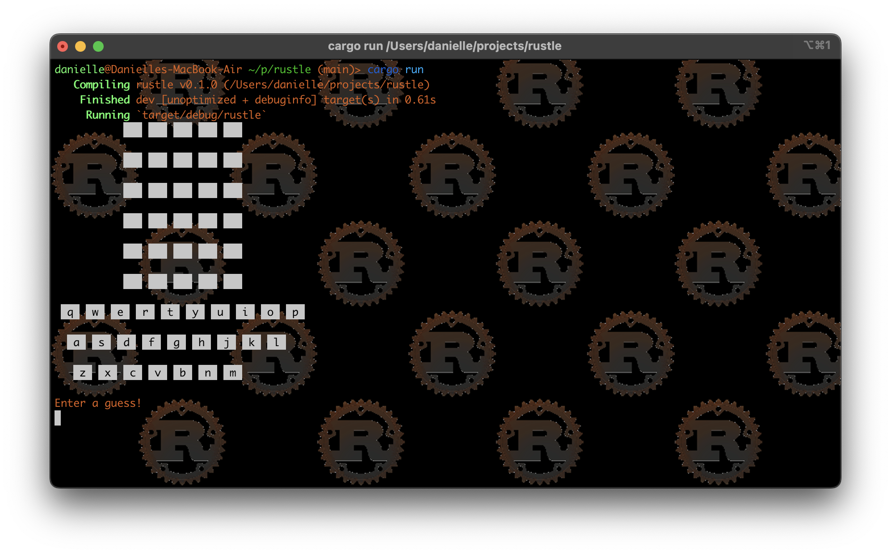
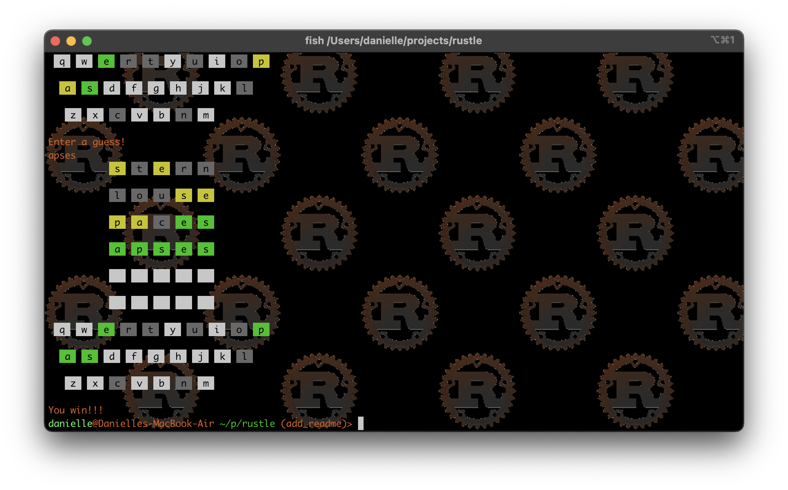

# Purpose

This project is an implementation of the canonical Wordle game, [https://www.nytimes.com/games/wordle/index.html](https://www.nytimes.com/games/wordle/index.html), written in Rust.

# Quick start

* Clone this repo:

```
git clone https://github.com/quephird/rustle
```

* Make you have Rust and Cargo installed; instructions for doing so are at [https://www.rust-lang.org/tools/install](https://www.rust-lang.org/tools/install).

* Build the project (it should not produce any warnings!)

```
cargo build
```

* Run the project

```
cargo run
```

You should now see a screen like below:



# Discussion

I had been going through an excellent tutorial on how to build a text editor in Rust, at [https://www.flenker.blog/hecto/](https://www.flenker.blog/hecto/), 
and it used a really cool terminal library called `termion`, [https://github.com/redox-os/termion](https://github.com/redox-os/termion),
and I wondered if I could think of another project that I could use it for.
So one day I decided to play with the iRust REPL, [https://github.com/sigmaSd/IRust](https://github.com/sigmaSd/IRust), 
and see if I could generate fakey Wordle guess results using it, 
just using `println!` statements and calls to `termion::color::Bg()` and it worked!
Then after playing around some more, I found that there were some limitations in debugging things in the REPL,
and I decided to make a full-fledged Cargo project out of the scraps of code that I had written.

The game itself is pretty much the same as the original, only that the interface is at the command line rather than a graphical one.
You will be prompted to submit a word, and the usual validations apply:

* The word must have letter characters only
* The word must have five letters only
* The word must appear in the dictionary

For this game, I used the word list that I found here, [https://www-cs-faculty.stanford.edu/~knuth/sgb-words.txt](https://www-cs-faculty.stanford.edu/~knuth/sgb-words.txt).
It has a lot of plurals and other words that aren't typically in the Wordle corpus but I couldn't find anything better.

The game board is displayed the same way as the original game with the following color scheme:

* Green for letters in the correct position
* Yellow for letters that are in the word but _not_ in the correct position
* Grey for letters that do not appear in the word at all
* White for letters that have not been guessed yet

A complete game will look like below:



